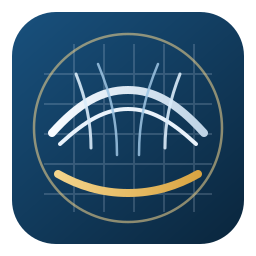

  

# Series 60 CB = 0.60 Benchmark Atlas

## Abstract

This repository presents a compact academic web atlas for the **Series 60 parent hull with block coefficient CB = 0.60**, integrating reconstructed hull-form geometry with published experimental self-propulsion data in a single static GitHub Pages site. The project is intended as a lightweight reference artifact for naval architecture, hydrodynamics, CFD benchmarking, seakeeping studies, and classroom demonstration.

The atlas combines:

- two-dimensional lines-plan style plots
- three-dimensional hull visualizations
- tabulated experimental results
- derived performance plots suitable for rapid comparative inspection

The repository is structured so that the published site can be served directly from the repository root with no build step.

## Scholarly Context

The Series 60 family remains one of the most frequently cited canonical hull series in marine hydrodynamics because of its systematic geometry, well-documented parent forms, and broad use in resistance, propulsion, and seakeeping validation exercises. The present atlas focuses on the **4210W parent form** corresponding to **CB = 0.60**, with geometry reconstructed from published offsets and validation data transcribed from the historical self-propulsion tables.

This repository is best understood as a **curated digital reference layer** rather than as a replacement for the original archival reports. Its purpose is to improve accessibility, inspection speed, and pedagogical clarity while preserving traceability to the source literature.

## Source Basis

The present visualization draws on the following source material available in this project workspace:

- Todd, F. H., *Series 60 Methodical Experiments with Models of Five Different Block Coefficients 0.60, 0.65, 0.70, 0.75, and 0.80*, DTMB Report 1712, 1963.
- ITTC Recommended Procedures and Guidelines 7.5-02-07-02.5 for benchmark and verification context.
- Supporting local data files containing reconstructed geometry and tabulated experimental results.

## Repository Scope

The public Pages-facing repository intentionally contains only the files required for publication and interpretation:

- `index.html`
  Repository-root entry point for GitHub Pages.
- `series60_cb060_geometry_m.html`
  Main interactive benchmark atlas page.
- `series60_cb060_geometry_data.js`
  Embedded geometry and experimental data companion file.
- `series60_benchmark_mark.svg`
  Project mark used as favicon and visual identity asset.

## Methodological Notes

### Geometry

The geometric plots represent a reconstructed digital rendering of the Series 60 CB = 0.60 parent hull in metric units. The visualization includes:

- a combined multi-panel 2D presentation
- separated body-plan, waterline, and profile views
- a waterline-derived 3D loft
- a triangular hull surface mesh

### Experimental Results

The validation section summarizes self-propulsion data for model 4210 across the available speed range, including EHP, SHP, and shaft rotational speed. The presentation is intended for rapid visual comparison rather than uncertainty quantification or statistical post-processing.

### Data Curation Remark

One RPM entry at **14 kn** appears in the scanned table as `609`, which is not physically consistent with the surrounding trend. In this atlas, that value is rendered as **60.9**, interpreted as an OCR or transcription artifact from the original scan. This choice is documented explicitly in the site to preserve scholarly transparency.

## Published Site

The GitHub Pages deployment for this repository is available at:

**https://andreacoraddu.github.io/series60-cb060-benchmark-atlas/**

## Intended Uses

This atlas may be useful for:

- academic teaching in naval architecture and marine hydrodynamics
- quick-reference hull-form inspection
- CFD and potential-flow benchmark orientation
- reproducibility notes in student or research workflows
- visual comparison against independently reconstructed Series 60 geometries

## Limitations

- The site is a visualization and reference artifact, not a full archival edition.
- No claim is made here of exhaustive uncertainty treatment.
- The geometry is reconstructed for interactive interpretation and should be cross-checked against primary sources before use in formal design or publication workflows.

## Recommended Citation

If you wish to cite this repository, a reasonable software-style citation would be:

> Coraddu, A. *Series 60 CB = 0.60 Benchmark Atlas*. GitHub repository and GitHub Pages site, 2026. Available at: https://github.com/andreacoraddu/series60-cb060-benchmark-atlas

## License and Use

No separate license file is currently included in this repository. Reuse should therefore be approached conservatively and with appropriate attribution to both this repository and the underlying historical source documents.
